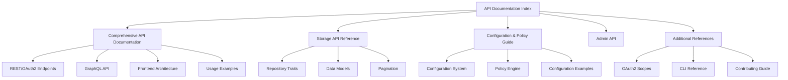
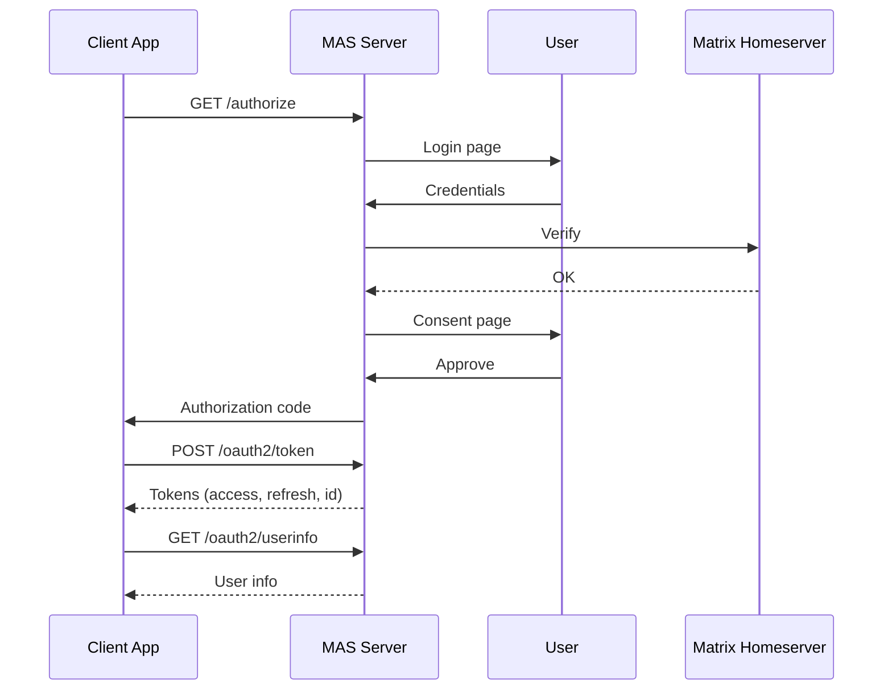
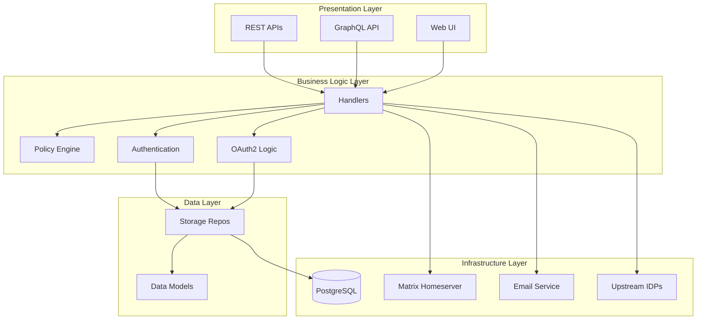

# Matrix Authentication Service - API Documentation

## Documentation Index

Welcome to the Matrix Authentication Service (MAS) API documentation. This comprehensive guide covers all public APIs, functions, and components with examples and usage instructions.

### 📚 Documentation Structure



---

## 📖 Main Documentation

### 1. [Comprehensive API Documentation](./COMPREHENSIVE_API_DOCUMENTATION.md)

**Complete guide to all MAS APIs with examples and diagrams.**

**Contents:**
- **System Architecture** - High-level architecture with mermaid diagrams
- **Core Crates** - Detailed documentation of all public crates
  - `mas-cli` - Command line interface
  - `mas-router` - URL routing
  - `mas-handlers` - Request handlers
  - `mas-data-model` - Domain models
  - `mas-storage` - Storage abstraction
  - `mas-config` - Configuration
  - `mas-keystore` - Key management
  - `mas-policy` - Policy engine
  - `mas-matrix` - Matrix integration
  - `mas-templates` - Template rendering
  - `oauth2-types` - OAuth2 types
- **REST API Endpoints** - Complete OAuth2/OIDC endpoint reference
  - Authorization endpoint
  - Token endpoint
  - UserInfo endpoint
  - Introspection endpoint
  - Revocation endpoint
  - Device authorization
  - Dynamic client registration
  - JWKS endpoint
- **GraphQL API** - Full GraphQL schema documentation
  - Queries (user, sessions, clients)
  - Mutations (user management, session control)
  - Pagination
- **Frontend Architecture** - React application structure
  - Component library
  - Routes
  - State management
- **Authentication Flows** - Detailed flow diagrams
  - Authorization Code Flow with PKCE
  - Device Code Flow
  - Upstream OAuth2 Login
  - Session Refresh
- **Usage Examples** - Code examples in multiple languages
  - Python OAuth2 client
  - JavaScript/TypeScript GraphQL client
  - Device code flow implementation
  - Matrix homeserver integration

### 2. [Storage API Reference](./STORAGE_API_REFERENCE.md)

**Complete reference for the storage layer and repository pattern.**

**Contents:**
- **Architecture** - Storage layer architecture diagram
- **Core Traits** 
  - `RepositoryAccess` - Main repository access trait
  - `Repository` - Transaction support
  - `RepositoryFactory` - Repository creation
- **Repository Details** - All repository interfaces
  - `UserRepository` - User management
  - `BrowserSessionRepository` - Browser sessions
  - `OAuth2SessionRepository` - OAuth2 sessions
  - `OAuth2ClientRepository` - OAuth2 clients
  - `OAuth2AccessTokenRepository` - Access tokens
  - `OAuth2RefreshTokenRepository` - Refresh tokens
  - `UserEmailRepository` - Email addresses
  - `UserPasswordRepository` - Passwords
  - And many more...
- **Pagination** - Cursor-based pagination system
- **Usage Examples** - Repository usage patterns
  - Creating users
  - Managing sessions
  - Transaction handling
  - Batch operations
- **Implementation Guide** - How to implement custom storage backends
- **Database Schema** - PostgreSQL schema diagram

### 3. [Configuration and Policy Guide](./CONFIGURATION_AND_POLICY_GUIDE.md)

**Complete guide to configuration system and policy engine.**

**Contents:**
- **Configuration System**
  - Configuration architecture
  - Configuration API
  - Main configuration sections:
    - Database
    - HTTP/Listeners
    - Matrix integration
    - Email
    - Upstream OAuth2 providers
    - Secrets/Keys
    - Sessions
    - Telemetry
    - Captcha
  - Environment variable substitution
  - Validation
- **Policy Engine**
  - OPA/Rego integration
  - Policy architecture
  - Policy types:
    - Authorization grant policies
    - Client registration policies
    - Email policies
    - Registration policies
  - Policy input types
  - Example policies
  - Policy data configuration
- **Complete Configuration Example**

---

## 🔗 Quick Links

### Core APIs

| API | Description | Documentation |
|-----|-------------|---------------|
| **REST/OAuth2** | OAuth 2.0 & OIDC endpoints | [REST API Endpoints](./COMPREHENSIVE_API_DOCUMENTATION.md#rest-api-endpoints) |
| **GraphQL** | GraphQL API for management | [GraphQL API](./COMPREHENSIVE_API_DOCUMENTATION.md#graphql-api) |
| **Storage** | Repository pattern & data access | [Storage API Reference](./STORAGE_API_REFERENCE.md) |
| **Configuration** | Configuration system | [Configuration Guide](./CONFIGURATION_AND_POLICY_GUIDE.md) |
| **Policy** | Authorization policies | [Policy Engine](./CONFIGURATION_AND_POLICY_GUIDE.md#policy-engine) |

### Key Crates

| Crate | Purpose | Documentation |
|-------|---------|---------------|
| `mas-cli` | Main application entry point | [CLI Documentation](./COMPREHENSIVE_API_DOCUMENTATION.md#1-mas-cli---command-line-interface) |
| `mas-handlers` | HTTP request handlers | [Handlers Documentation](./COMPREHENSIVE_API_DOCUMENTATION.md#3-mas-handlers---request-handlers) |
| `mas-router` | URL routing | [Router Documentation](./COMPREHENSIVE_API_DOCUMENTATION.md#2-mas-router---url-routing) |
| `mas-data-model` | Domain models | [Data Model Documentation](./COMPREHENSIVE_API_DOCUMENTATION.md#4-mas-data-model---data-models) |
| `mas-storage` | Storage abstraction | [Storage Documentation](./STORAGE_API_REFERENCE.md) |
| `mas-config` | Configuration loading | [Config Documentation](./CONFIGURATION_AND_POLICY_GUIDE.md#configuration-system) |
| `mas-policy` | Policy engine | [Policy Documentation](./CONFIGURATION_AND_POLICY_GUIDE.md#policy-engine) |

---

## 🚀 Quick Start

### 1. Understanding the Architecture

Start with the [System Architecture](./COMPREHENSIVE_API_DOCUMENTATION.md#system-architecture) section to understand how MAS components fit together.

### 2. REST API Integration

For integrating with MAS as an OAuth2/OIDC provider:

1. Read [REST API Endpoints](./COMPREHENSIVE_API_DOCUMENTATION.md#rest-api-endpoints)
2. Review [Authentication Flows](./COMPREHENSIVE_API_DOCUMENTATION.md#authentication-flows)
3. Check [Usage Examples](./COMPREHENSIVE_API_DOCUMENTATION.md#usage-examples)
4. Follow the [Integration Guide](./COMPREHENSIVE_API_DOCUMENTATION.md#integration-guide)

### 3. GraphQL API Usage

For using the GraphQL API:

1. Read [GraphQL API](./COMPREHENSIVE_API_DOCUMENTATION.md#graphql-api)
2. Review query and mutation examples
3. Check the [GraphQL schema](../schema.graphql)
4. Try the GraphQL playground (if enabled)

### 4. Frontend Development

For working with the frontend:

1. Read [Frontend Architecture](./COMPREHENSIVE_API_DOCUMENTATION.md#frontend-architecture)
2. Explore components in `frontend/src/components/`
3. Review routes in `frontend/src/routes/`

### 5. Storage Layer

For working with data persistence:

1. Read [Storage API Reference](./STORAGE_API_REFERENCE.md)
2. Understand repository patterns
3. Review data models
4. Check usage examples

### 6. Configuration

For configuring MAS:

1. Read [Configuration System](./CONFIGURATION_AND_POLICY_GUIDE.md#configuration-system)
2. Review configuration sections
3. Check the complete example
4. Set up environment variables

### 7. Policy Engine

For implementing custom policies:

1. Read [Policy Engine](./CONFIGURATION_AND_POLICY_GUIDE.md#policy-engine)
2. Review example policies
3. Write your own Rego policies
4. Configure policy data

---

## 📊 API Overview Diagrams

### OAuth2/OIDC Flow



### Component Layers



---

## 🔐 Authentication & Authorization

### Supported Grant Types

- **Authorization Code** - Standard OAuth2 authorization code flow
- **Authorization Code + PKCE** - Enhanced security for public clients
- **Refresh Token** - Token refresh without re-authentication
- **Device Code** - For devices with limited input capabilities
- **Client Credentials** - Service-to-service authentication (limited support)

### Supported Authentication Methods

- **Password** - Username and password
- **Upstream OAuth2** - Sign in with external providers (Google, GitHub, etc.)
- **Matrix SSO** - Compatibility with Matrix Synapse SSO

### Token Types

- **Access Token** - Short-lived token for API access
- **Refresh Token** - Long-lived token for obtaining new access tokens
- **ID Token** - OIDC identity token (JWT)

---

## 📝 Code Examples

### Quick Example: Python OAuth2 Client

```python
from mas_client import MASClient

# Initialize client
client = MASClient(
    issuer_url="https://auth.example.com",
    client_id="your_client_id",
    client_secret="your_client_secret",
    redirect_uri="https://yourapp.example.com/callback"
)

# Get authorization URL
auth_url, state, code_verifier = client.get_authorization_url()
print(f"Visit: {auth_url}")

# After user authorizes, exchange code for tokens
tokens = client.exchange_code(code, code_verifier)

# Get user info
userinfo = client.get_userinfo(tokens['access_token'])
print(f"Logged in as: {userinfo['preferred_username']}")
```

### Quick Example: GraphQL Query

```typescript
import { GraphQLClient, gql } from 'graphql-request';

const client = new GraphQLClient('https://auth.example.com/graphql', {
  headers: { authorization: `Bearer ${accessToken}` },
});

const query = gql`
  query {
    viewer {
      ... on User {
        id
        username
        emails {
          edges {
            node {
              email
              confirmedAt
            }
          }
        }
      }
    }
  }
`;

const data = await client.request(query);
console.log(data.viewer);
```

---

## 🛠️ Development Resources

### Additional Documentation

- **[Contributing Guide](../development/contributing.html)** - How to contribute to MAS
- **[CLI Reference](../reference/cli/)** - Command line interface documentation
- **[Scopes Reference](../reference/scopes.md)** - OAuth2 scopes supported
- **[Configuration Reference](../reference/configuration.md)** - Full configuration options
- **[Rustdoc](../rustdoc/mas_handlers/)** - Auto-generated Rust API documentation
- **[Storybook](../storybook/)** - Frontend component documentation

### External Resources

- **[MSC3861](https://github.com/matrix-org/matrix-doc/pull/3861)** - Matrix Spec Change for OIDC
- **[OAuth 2.0 RFC](https://datatracker.ietf.org/doc/html/rfc6749)** - OAuth 2.0 specification
- **[OpenID Connect](https://openid.net/connect/)** - OIDC specification
- **[OPA Documentation](https://www.openpolicyagent.org/docs/)** - Open Policy Agent docs

---

## 🆘 Support

### Community

- **Matrix Room**: [#matrix-auth:matrix.org](https://matrix.to/#/#matrix-auth:matrix.org)
- **GitHub Issues**: [Report bugs or request features](https://github.com/element-hq/matrix-authentication-service/issues)

### Commercial Support

For commercial support and licenses, contact [Element](https://element.io/).

---

## 📄 License

Matrix Authentication Service is dual-licensed:

- **AGPL-3.0-only** - Open source license
- **LicenseRef-Element-Commercial** - Commercial license from Element

See [LICENSE](../../LICENSE) and [LICENSE-COMMERCIAL](../../LICENSE-COMMERCIAL) files for details.

---

## 🔄 Version Information

- **Current Version**: 1.5.0
- **API Stability**: Beta
- **Last Updated**: 2025-10-30

---

## 📈 API Changelog

### Version 1.5.0 (Current)

- Complete OAuth2 and OIDC support
- GraphQL API for account management
- Upstream OAuth2 provider support
- Policy engine integration
- Device code flow support
- Dynamic client registration

### Future Roadmap

See the [GitHub project board](https://github.com/element-hq/matrix-authentication-service/projects) for upcoming features.

---

*For the most up-to-date documentation, visit [https://element-hq.github.io/matrix-authentication-service/](https://element-hq.github.io/matrix-authentication-service/)*
