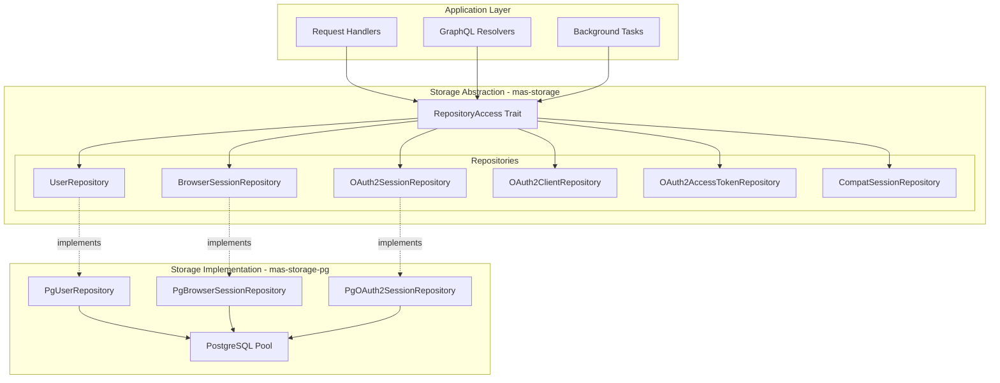
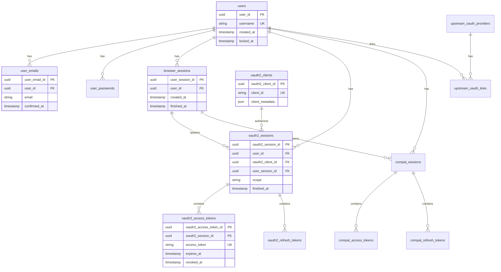

# Storage API Reference

## Overview

The MAS storage layer provides a repository-based abstraction over the persistence layer. This document details the storage API, repository traits, and how to implement custom storage backends.

## Architecture



## Core Traits

### RepositoryAccess

The main trait that provides access to all repositories.

```rust
pub trait RepositoryAccess: Send {
    /// The backend-specific error type
    type Error: std::error::Error + Send + Sync + 'static;
    
    // User Management
    fn user<'c>(&'c mut self) -> Box<dyn UserRepository<Error = Self::Error> + 'c>;
    fn user_email<'c>(&'c mut self) -> Box<dyn UserEmailRepository<Error = Self::Error> + 'c>;
    fn user_password<'c>(&'c mut self) -> Box<dyn UserPasswordRepository<Error = Self::Error> + 'c>;
    fn user_registration<'c>(&'c mut self) -> Box<dyn UserRegistrationRepository<Error = Self::Error> + 'c>;
    fn user_recovery<'c>(&'c mut self) -> Box<dyn UserRecoveryRepository<Error = Self::Error> + 'c>;
    
    // Session Management
    fn browser_session<'c>(&'c mut self) -> Box<dyn BrowserSessionRepository<Error = Self::Error> + 'c>;
    fn app_session<'c>(&'c mut self) -> Box<dyn AppSessionRepository<Error = Self::Error> + 'c>;
    
    // OAuth2
    fn oauth2_client<'c>(&'c mut self) -> Box<dyn OAuth2ClientRepository<Error = Self::Error> + 'c>;
    fn oauth2_authorization_grant<'c>(&'c mut self) -> Box<dyn OAuth2AuthorizationGrantRepository<Error = Self::Error> + 'c>;
    fn oauth2_session<'c>(&'c mut self) -> Box<dyn OAuth2SessionRepository<Error = Self::Error> + 'c>;
    fn oauth2_access_token<'c>(&'c mut self) -> Box<dyn OAuth2AccessTokenRepository<Error = Self::Error> + 'c>;
    fn oauth2_refresh_token<'c>(&'c mut self) -> Box<dyn OAuth2RefreshTokenRepository<Error = Self::Error> + 'c>;
    fn oauth2_device_code_grant<'c>(&'c mut self) -> Box<dyn OAuth2DeviceCodeGrantRepository<Error = Self::Error> + 'c>;
    
    // Compatibility Layer (Matrix Synapse)
    fn compat_session<'c>(&'c mut self) -> Box<dyn CompatSessionRepository<Error = Self::Error> + 'c>;
    fn compat_access_token<'c>(&'c mut self) -> Box<dyn CompatAccessTokenRepository<Error = Self::Error> + 'c>;
    fn compat_refresh_token<'c>(&'c mut self) -> Box<dyn CompatRefreshTokenRepository<Error = Self::Error> + 'c>;
    fn compat_sso_login<'c>(&'c mut self) -> Box<dyn CompatSsoLoginRepository<Error = Self::Error> + 'c>;
    
    // Upstream OAuth2
    fn upstream_oauth_provider<'c>(&'c mut self) -> Box<dyn UpstreamOAuthProviderRepository<Error = Self::Error> + 'c>;
    fn upstream_oauth_link<'c>(&'c mut self) -> Box<dyn UpstreamOAuthLinkRepository<Error = Self::Error> + 'c>;
    fn upstream_oauth_session<'c>(&'c mut self) -> Box<dyn UpstreamOAuthSessionRepository<Error = Self::Error> + 'c>;
    
    // Jobs and Tasks
    fn job<'c>(&'c mut self) -> Box<dyn JobRepository<Error = Self::Error> + 'c>;
}
```

### Repository Transaction

All repositories support transactions:

```rust
pub trait Repository: RepositoryAccess {
    type Error: std::error::Error + Send + Sync + 'static;
    
    /// Save all changes made in this repository
    async fn save(self) -> Result<(), Self::Error>;
    
    /// Cancel all changes made in this repository
    async fn cancel(self) -> Result<(), Self::Error>;
}

// Type-erased version
pub type BoxRepository = Box<dyn Repository<Error = BoxError>>;
```

### Repository Factory

Factory for creating repository instances:

```rust
pub trait RepositoryFactory: Send + Sync {
    type Repository: Repository;
    type Error: std::error::Error + Send + Sync + 'static;
    
    /// Create a new repository instance
    async fn repository(&self) -> Result<Self::Repository, Self::Error>;
}

pub type BoxRepositoryFactory = Box<dyn RepositoryFactory<Repository = BoxRepository, Error = BoxError>>;
```

## Repository Details

### UserRepository

Manages user accounts.

```rust
#[async_trait]
pub trait UserRepository: Send + Sync {
    type Error;
    
    /// Lookup a user by ID
    async fn lookup(&mut self, id: Ulid) -> Result<Option<User>, Self::Error>;
    
    /// Find a user by username
    async fn find_by_username(&mut self, username: &str) -> Result<Option<User>, Self::Error>;
    
    /// Add a new user
    async fn add(
        &mut self,
        rng: &mut (dyn RngCore + Send),
        clock: &dyn Clock,
        username: String,
    ) -> Result<User, Self::Error>;
    
    /// Lock a user account
    async fn lock(
        &mut self,
        clock: &dyn Clock,
        user: User,
    ) -> Result<User, Self::Error>;
    
    /// Unlock a user account
    async fn unlock(&mut self, user: User) -> Result<User, Self::Error>;
    
    /// Set user display name
    async fn set_display_name(
        &mut self,
        clock: &dyn Clock,
        user: User,
        display_name: Option<String>,
    ) -> Result<User, Self::Error>;
    
    /// List users with pagination
    async fn list(
        &mut self,
        filter: UserFilter,
        pagination: Pagination,
    ) -> Result<Page<User>, Self::Error>;
    
    /// Count users matching filter
    async fn count(&mut self, filter: UserFilter) -> Result<usize, Self::Error>;
    
    /// Mark user for deletion
    async fn mark_for_deletion(
        &mut self,
        clock: &dyn Clock,
        user: User,
    ) -> Result<User, Self::Error>;
}
```

**User Filter:**

```rust
pub struct UserFilter {
    pub state: Option<UserState>,
    pub can_request_admin: Option<bool>,
}

pub enum UserState {
    Active,
    Locked,
}
```

### BrowserSessionRepository

Manages browser sessions (user sessions in web browser).

```rust
#[async_trait]
pub trait BrowserSessionRepository: Send + Sync {
    type Error;
    
    /// Lookup a session by ID
    async fn lookup(&mut self, id: Ulid) -> Result<Option<BrowserSession>, Self::Error>;
    
    /// Create a new browser session
    async fn add(
        &mut self,
        rng: &mut (dyn RngCore + Send),
        clock: &dyn Clock,
        user: &User,
        user_agent: Option<UserAgent>,
    ) -> Result<BrowserSession, Self::Error>;
    
    /// Finish a browser session
    async fn finish(
        &mut self,
        clock: &dyn Clock,
        session: BrowserSession,
    ) -> Result<BrowserSession, Self::Error>;
    
    /// List sessions for a user
    async fn list(
        &mut self,
        filter: BrowserSessionFilter,
        pagination: Pagination,
    ) -> Result<Page<BrowserSession>, Self::Error>;
    
    /// Count sessions matching filter
    async fn count(&mut self, filter: BrowserSessionFilter) -> Result<usize, Self::Error>;
    
    /// Record activity on a session
    async fn record_batch_activity(
        &mut self,
        activity: Vec<(Ulid, DateTime<Utc>)>,
    ) -> Result<(), Self::Error>;
    
    /// Get authentication for a session
    async fn get_authentication(
        &mut self,
        session: &BrowserSession,
    ) -> Result<Option<Authentication>, Self::Error>;
}
```

**Browser Session Filter:**

```rust
pub struct BrowserSessionFilter {
    pub user: Option<User>,
    pub state: Option<BrowserSessionState>,
}

pub enum BrowserSessionState {
    Active,
    Finished,
}
```

### OAuth2SessionRepository

Manages OAuth2 sessions (app sessions).

```rust
#[async_trait]
pub trait OAuth2SessionRepository: Send + Sync {
    type Error;
    
    /// Lookup a session by ID
    async fn lookup(&mut self, id: Ulid) -> Result<Option<Session>, Self::Error>;
    
    /// Create a new OAuth2 session
    async fn add(
        &mut self,
        rng: &mut (dyn RngCore + Send),
        clock: &dyn Clock,
        client: &Client,
        user: Option<&User>,
        user_session: Option<&BrowserSession>,
        scope: Scope,
    ) -> Result<Session, Self::Error>;
    
    /// Finish an OAuth2 session
    async fn finish(
        &mut self,
        clock: &dyn Clock,
        session: Session,
    ) -> Result<Session, Self::Error>;
    
    /// List sessions
    async fn list(
        &mut self,
        filter: OAuth2SessionFilter,
        pagination: Pagination,
    ) -> Result<Page<Session>, Self::Error>;
    
    /// Count sessions matching filter
    async fn count(&mut self, filter: OAuth2SessionFilter) -> Result<usize, Self::Error>;
    
    /// Record batch activity
    async fn record_batch_activity(
        &mut self,
        activity: Vec<(Ulid, DateTime<Utc>)>,
    ) -> Result<(), Self::Error>;
}
```

**OAuth2 Session Filter:**

```rust
pub struct OAuth2SessionFilter {
    pub user: Option<User>,
    pub client: Option<Client>,
    pub browser_session: Option<BrowserSession>,
    pub state: Option<SessionState>,
    pub scope: Option<Scope>,
}

pub enum SessionState {
    Active,
    Finished,
}
```

### OAuth2ClientRepository

Manages OAuth2 clients.

```rust
#[async_trait]
pub trait OAuth2ClientRepository: Send + Sync {
    type Error;
    
    /// Lookup a client by ID
    async fn lookup(&mut self, id: Ulid) -> Result<Option<Client>, Self::Error>;
    
    /// Find a client by client_id
    async fn find_by_client_id(&mut self, client_id: &str) -> Result<Option<Client>, Self::Error>;
    
    /// Add a new client
    async fn add(
        &mut self,
        rng: &mut (dyn RngCore + Send),
        clock: &dyn Clock,
        redirect_uris: Vec<Url>,
        encrypted_client_secret: Option<String>,
        client_metadata: ClientMetadata,
    ) -> Result<Client, Self::Error>;
    
    /// List clients
    async fn list(
        &mut self,
        filter: OAuth2ClientFilter,
        pagination: Pagination,
    ) -> Result<Page<Client>, Self::Error>;
    
    /// Count clients
    async fn count(&mut self, filter: OAuth2ClientFilter) -> Result<usize, Self::Error>;
}
```

### OAuth2AccessTokenRepository

Manages OAuth2 access tokens.

```rust
#[async_trait]
pub trait OAuth2AccessTokenRepository: Send + Sync {
    type Error;
    
    /// Lookup an access token by ID
    async fn lookup(&mut self, id: Ulid) -> Result<Option<AccessToken>, Self::Error>;
    
    /// Find an access token by token string
    async fn find_by_token(
        &mut self,
        access_token: &str,
    ) -> Result<Option<AccessToken>, Self::Error>;
    
    /// Add a new access token
    async fn add(
        &mut self,
        rng: &mut (dyn RngCore + Send),
        clock: &dyn Clock,
        session: &Session,
        access_token: String,
        expires_after: Option<Duration>,
    ) -> Result<AccessToken, Self::Error>;
    
    /// Revoke an access token
    async fn revoke(
        &mut self,
        clock: &dyn Clock,
        access_token: AccessToken,
    ) -> Result<AccessToken, Self::Error>;
    
    /// Cleanup expired tokens
    async fn cleanup_expired(
        &mut self,
        clock: &dyn Clock,
    ) -> Result<usize, Self::Error>;
}
```

### OAuth2RefreshTokenRepository

Manages OAuth2 refresh tokens.

```rust
#[async_trait]
pub trait OAuth2RefreshTokenRepository: Send + Sync {
    type Error;
    
    /// Lookup a refresh token by ID
    async fn lookup(&mut self, id: Ulid) -> Result<Option<RefreshToken>, Self::Error>;
    
    /// Find a refresh token by token string
    async fn find_by_token(
        &mut self,
        refresh_token: &str,
    ) -> Result<Option<RefreshToken>, Self::Error>;
    
    /// Add a new refresh token
    async fn add(
        &mut self,
        rng: &mut (dyn RngCore + Send),
        clock: &dyn Clock,
        session: &Session,
        access_token: &AccessToken,
        refresh_token: String,
    ) -> Result<RefreshToken, Self::Error>;
    
    /// Consume a refresh token (for token rotation)
    async fn consume(
        &mut self,
        clock: &dyn Clock,
        refresh_token: RefreshToken,
    ) -> Result<RefreshToken, Self::Error>;
    
    /// Revoke a refresh token
    async fn revoke(
        &mut self,
        clock: &dyn Clock,
        refresh_token: RefreshToken,
    ) -> Result<RefreshToken, Self::Error>;
}
```

### UserEmailRepository

Manages user email addresses.

```rust
#[async_trait]
pub trait UserEmailRepository: Send + Sync {
    type Error;
    
    /// Lookup an email by ID
    async fn lookup(&mut self, id: Ulid) -> Result<Option<UserEmail>, Self::Error>;
    
    /// Find an email by address
    async fn find(&mut self, email: &str) -> Result<Option<UserEmail>, Self::Error>;
    
    /// Find all emails for a user
    async fn list(&mut self, user: &User) -> Result<Vec<UserEmail>, Self::Error>;
    
    /// Add an email address to a user
    async fn add(
        &mut self,
        rng: &mut (dyn RngCore + Send),
        clock: &dyn Clock,
        user: &User,
        email: String,
    ) -> Result<UserEmail, Self::Error>;
    
    /// Remove an email address
    async fn remove(&mut self, user_email: UserEmail) -> Result<(), Self::Error>;
    
    /// Mark email as verified
    async fn mark_as_verified(
        &mut self,
        clock: &dyn Clock,
        user_email: UserEmail,
    ) -> Result<UserEmail, Self::Error>;
    
    /// Set primary email
    async fn set_as_primary(
        &mut self,
        user_email: &UserEmail,
    ) -> Result<(), Self::Error>;
}
```

### UserPasswordRepository

Manages user passwords.

```rust
#[async_trait]
pub trait UserPasswordRepository: Send + Sync {
    type Error;
    
    /// Lookup the active password for a user
    async fn lookup_active_for_user(
        &mut self,
        user: &User,
    ) -> Result<Option<Password>, Self::Error>;
    
    /// Add a password for a user
    async fn add(
        &mut self,
        rng: &mut (dyn RngCore + Send),
        clock: &dyn Clock,
        user: &User,
        version: PasswordVersion,
        hashed_password: String,
        upgraded_from: Option<&Password>,
    ) -> Result<Password, Self::Error>;
}
```

## Pagination

The storage API uses cursor-based pagination:

```rust
pub struct Pagination {
    /// Return the first N items
    pub first: Option<usize>,
    
    /// Return items after this cursor
    pub after: Option<String>,
    
    /// Return the last N items
    pub last: Option<usize>,
    
    /// Return items before this cursor
    pub before: Option<String>,
}

pub struct Page<T> {
    /// The items in this page
    pub edges: Vec<Edge<T>>,
    
    /// Information about the current page
    pub page_info: PageInfo,
}

pub struct Edge<T> {
    /// The cursor for this item
    pub cursor: String,
    
    /// The item itself
    pub node: T,
}

pub struct PageInfo {
    /// Whether there are more items after this page
    pub has_next_page: bool,
    
    /// Whether there are more items before this page
    pub has_previous_page: bool,
    
    /// Cursor pointing to the start of this page
    pub start_cursor: Option<String>,
    
    /// Cursor pointing to the end of this page
    pub end_cursor: Option<String>,
}
```

## Usage Examples

### Example 1: Creating a User

```rust
use mas_storage::{RepositoryAccess, user::UserRepository};
use mas_data_model::{Clock, User};
use rand::SeedableRng;

async fn create_user(
    repo: &mut impl RepositoryAccess,
    clock: &dyn Clock,
    username: String,
) -> Result<User, Box<dyn std::error::Error>> {
    let mut rng = rand_chacha::ChaChaRng::from_entropy();
    
    let user = repo.user()
        .add(&mut rng, clock, username)
        .await?;
    
    Ok(user)
}
```

### Example 2: Listing Active Sessions

```rust
use mas_storage::{RepositoryAccess, app_session::BrowserSessionRepository};
use mas_data_model::{User, BrowserSession};

async fn list_active_sessions(
    repo: &mut impl RepositoryAccess,
    user: &User,
) -> Result<Vec<BrowserSession>, Box<dyn std::error::Error>> {
    use mas_storage::app_session::BrowserSessionFilter;
    use mas_storage::Pagination;
    
    let filter = BrowserSessionFilter::default()
        .for_user(user)
        .active_only();
    
    let pagination = Pagination {
        first: Some(100),
        ..Default::default()
    };
    
    let page = repo.browser_session()
        .list(filter, pagination)
        .await?;
    
    let sessions = page.edges.into_iter()
        .map(|edge| edge.node)
        .collect();
    
    Ok(sessions)
}
```

### Example 3: Creating an OAuth2 Session

```rust
use mas_storage::{RepositoryAccess, oauth2::OAuth2SessionRepository};
use mas_data_model::{User, Client, BrowserSession, Session};
use oauth2_types::scope::Scope;

async fn create_oauth2_session(
    repo: &mut impl RepositoryAccess,
    clock: &dyn Clock,
    client: &Client,
    user: &User,
    browser_session: &BrowserSession,
    scope: Scope,
) -> Result<Session, Box<dyn std::error::Error>> {
    let mut rng = rand_chacha::ChaChaRng::from_entropy();
    
    let session = repo.oauth2_session()
        .add(
            &mut rng,
            clock,
            client,
            Some(user),
            Some(browser_session),
            scope,
        )
        .await?;
    
    Ok(session)
}
```

### Example 4: Transaction Management

```rust
use mas_storage::{Repository, RepositoryFactory};

async fn update_user_with_transaction(
    factory: &impl RepositoryFactory,
    user_id: Ulid,
    new_display_name: String,
) -> Result<(), Box<dyn std::error::Error>> {
    // Create a repository instance (starts a transaction)
    let mut repo = factory.repository().await?;
    let clock = SystemClock::default();
    
    // Look up the user
    let user = repo.user()
        .lookup(user_id)
        .await?
        .ok_or("User not found")?;
    
    // Update the user
    let updated_user = repo.user()
        .set_display_name(&clock, user, Some(new_display_name))
        .await?;
    
    // Commit the transaction
    repo.save().await?;
    
    Ok(())
}
```

### Example 5: Batch Activity Recording

```rust
use mas_storage::{RepositoryAccess, app_session::BrowserSessionRepository};
use chrono::{DateTime, Utc};

async fn record_session_activity(
    repo: &mut impl RepositoryAccess,
    activities: Vec<(Ulid, DateTime<Utc>)>,
) -> Result<(), Box<dyn std::error::Error>> {
    repo.browser_session()
        .record_batch_activity(activities)
        .await?;
    
    Ok(())
}
```

## Implementing a Custom Repository

To implement a custom storage backend:

1. **Implement the Repository trait:**

```rust
pub struct MyRepository {
    // Your storage connection/context
    connection: MyDatabaseConnection,
}

#[async_trait]
impl Repository for MyRepository {
    type Error = MyError;
    
    async fn save(self) -> Result<(), Self::Error> {
        self.connection.commit().await
    }
    
    async fn cancel(self) -> Result<(), Self::Error> {
        self.connection.rollback().await
    }
}
```

2. **Implement RepositoryAccess:**

```rust
#[async_trait]
impl RepositoryAccess for MyRepository {
    type Error = MyError;
    
    fn user<'c>(&'c mut self) -> Box<dyn UserRepository<Error = Self::Error> + 'c> {
        Box::new(MyUserRepository {
            connection: &mut self.connection,
        })
    }
    
    // ... implement other repository getters
}
```

3. **Implement individual repositories:**

```rust
struct MyUserRepository<'c> {
    connection: &'c mut MyDatabaseConnection,
}

#[async_trait]
impl UserRepository for MyUserRepository<'_> {
    type Error = MyError;
    
    async fn lookup(&mut self, id: Ulid) -> Result<Option<User>, Self::Error> {
        // Your implementation
    }
    
    // ... implement other methods
}
```

4. **Implement RepositoryFactory:**

```rust
pub struct MyRepositoryFactory {
    pool: MyConnectionPool,
}

#[async_trait]
impl RepositoryFactory for MyRepositoryFactory {
    type Repository = MyRepository;
    type Error = MyError;
    
    async fn repository(&self) -> Result<Self::Repository, Self::Error> {
        let connection = self.pool.acquire().await?;
        Ok(MyRepository { connection })
    }
}
```

## Database Schema (PostgreSQL)

The PostgreSQL implementation uses the following main tables:



## Performance Considerations

1. **Connection Pooling**: Use a connection pool for database connections
2. **Batch Operations**: Use `record_batch_activity` for bulk updates
3. **Indexes**: Ensure proper database indexes on foreign keys and lookup fields
4. **Pagination**: Use cursor-based pagination for large result sets
5. **Cleanup Jobs**: Run periodic cleanup for expired tokens
6. **Caching**: Consider caching frequently accessed data (clients, configurations)

## Error Handling

All repository methods return `Result<T, Self::Error>` where `Self::Error` is the backend-specific error type. The common pattern is:

```rust
match repo.user().lookup(user_id).await {
    Ok(Some(user)) => {
        // User found
    }
    Ok(None) => {
        // User not found (not an error)
    }
    Err(e) => {
        // Database error or other failure
    }
}
```

## Testing

For testing, use the in-memory mock implementation or test fixtures:

```rust
#[cfg(test)]
mod tests {
    use mas_storage_pg::PgRepositoryFactory;
    
    #[tokio::test]
    async fn test_user_creation() {
        let factory = PgRepositoryFactory::new(test_db_url()).await.unwrap();
        let mut repo = factory.repository().await.unwrap();
        let clock = SystemClock::default();
        let mut rng = ChaChaRng::from_entropy();
        
        let user = repo.user()
            .add(&mut rng, &clock, "testuser".to_string())
            .await
            .unwrap();
        
        assert_eq!(user.username, "testuser");
        
        repo.save().await.unwrap();
    }
}
```

---

*Last Updated: 2025-10-30*
