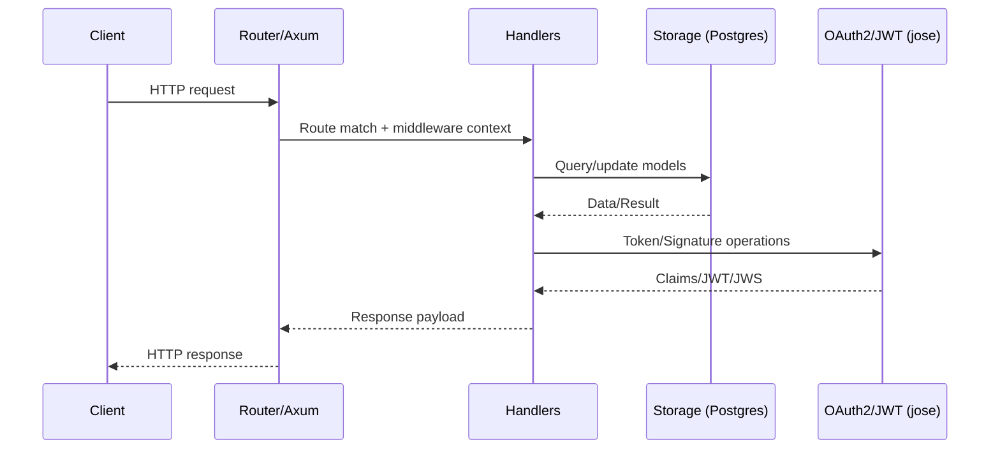
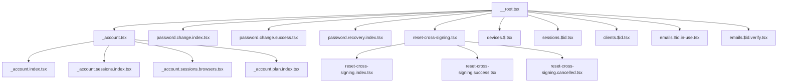

# Diagrams

This page provides high-level visualizations of the system using Mermaid. These complement the detailed API docs:

- Rust crate docs: [rustdoc](../rustdoc/)
- Admin API (OpenAPI): [Swagger UI](../api/index.html)
- Frontend components: [Storybook](../storybook/)
- Frontend TypeScript API: [TypeDoc](../tsdoc/)

## Backend crates and dependencies

```mermaid
graph LR
  subgraph Backend (Rust)
    A[crates/handlers] --> B[crates/http]
    A --> C[crates/data-model]
    A --> D[crates/storage]
    D --> E[crates/storage-pg]
    A --> F[crates/config]
    A --> G[crates/context]
    A --> H[crates/i18n]
    A --> I[crates/email]
    A --> J[crates/keystore]
    J --> K[crates/jose]
    A --> L[crates/oauth2-types]
    A --> M[crates/oidc-client]
    B --> N[crates/axum-utils]
    B --> O[crates/router]
    O --> A
    A --> P[crates/templates]
    A --> Q[crates/tasks]
    A --> R[crates/listener]
    A --> S[crates/tower]
    A --> T[crates/matrix]
    T --> U[crates/matrix-synapse]
    A --> V[crates/spa]
    A --> W[crates/policy]
  end
```

Notes:
- `crates/handlers` implements HTTP handlers and business logic, depending on configuration, storage, i18n, email, keystore, etc.
- `crates/http` wires Axum, routing, and middleware.
- `crates/storage` defines storage traits; `crates/storage-pg` provides the PostgreSQL implementation.

## Request flow (sequence)



## Frontend routes (React)



## Admin API overview

```mermaid
graph LR
  subgraph Admin API (OpenAPI)
    U[Users]
    C[Clients]
    S[Sessions]
    E[Emails]
    D[Devices]
    A[Audit/Policy]
  end

  UI[Swagger UI] -->|OAuth2| Admin((Admin user))
  Admin -->|Calls| U
  Admin --> C
  Admin --> S
  Admin --> E
  Admin --> D
  Admin --> A
```

For full endpoint details and try-it-out, see the [Swagger UI](../api/index.html) and the raw [spec.json](../api/spec.json).
